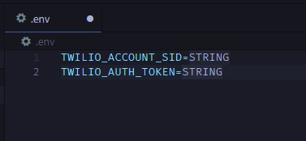

## CSUS Course Availability

Quick script used to check available courses from Sacramento State University. Will periodically check the CSUS Course API and will notify a user if a section opens up. 

### Setup
1. Download python https://www.python.org/downloads/
2. Clone the repository to your local machine.
3. Once you have cloned the repository, change directories (`cd`) into the cloned repository.
4. Create a virtual env for your project. 
    - WIN: `python3 -m venv venv` -> `venv\Scripts\activate.bat`
    - MAC: `python3 -m venv venv` -> `source venv\bin\activate`
5. Once you have your environment setup, install the required dependencies. `pip3 install -r requirements.txt`
6. Edit the config.json file with the course, and term you are looking for. If you would like to recieve SMS notifications from twilio, setup an account and set the properties accordingly in config.json. Else just set the utilize value to `false`. 
   - If you are using twilio navigate to https://console.twilio.com/, setup a plan for a phone number and retrieve your Account SID and Token. Insert the SID and token into a .env file as below. 
       - 
7. Run the script and await a notification. `python3 main.py`
8. Best of Luck!! >:)